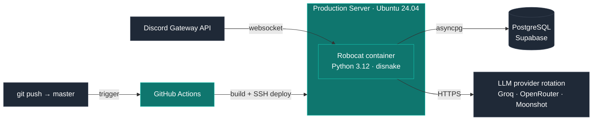

# Robocat

[](https://github.com/szarkans/robocat/actions)
[](https://www.python.org/)
[](https://www.docker.com/)
[](https://supabase.com/)
[](LICENSE)

Production Discord bot serving an online gaming community (~500 MAU).
Built with `disnake`, `asyncio`, PostgreSQL, and a multi-provider LLM integration layer.
Full development → containerization → CI/CD → production lifecycle.

> Live deployment: [discord.gg/6f3FwFRJWC](https://discord.gg/6f3FwFRJWC)

---

## Architecture



Average commit-to-production deploy time: **~2–3 minutes**.

---

## Tech Stack

| Layer            | Technology                                                        |
| ---------------- | ----------------------------------------------------------------- |
| Runtime          | Python 3.12, `asyncio`                                            |
| Discord client   | `disnake` (Components V2)                                         |
| Database         | PostgreSQL (Supabase) · `asyncpg`                                 |
| LLM integration  | Provider rotation: Groq, OpenRouter, Moonshot AI                  |
| Containerization | Docker                                                            |
| CI/CD            | GitHub Actions → SSH deploy                                       |
| Documentation    | VitePress (auto-deployed to GitHub Pages)                         |

LLM models in rotation: Llama 3.1 405B, Llama 3.3 70B Versatile, GPT-OSS 120B, DeepSeek V3, DeepSeek R1, Kimi K2.6.

---

## Features

- **Flag system** — attach arbitrary metadata to any Discord object (channel, user, category, message).
- **Ticket system** — administration contact, bug reports, in-game moderation appeals.
- **LLM chatbot** — multi-provider rotation with fallback on rate limits.
- **Role selection** via Dropdown components.
- **FAQ, utility, moderation commands**.

---

## Quick Start (local)

```bash
git clone https://github.com/szarkans/robocat.git
cd robocat

cp .env.example .env
# fill in DISCORD_TOKEN, database credentials, LLM API keys

docker build -t robocat .
docker run --env-file .env robocat
```

---

## Deployment

Production deploys are fully automated:

1. `git push` to `master`
2. GitHub Actions runner picks up the workflow in `.github/workflows/`
3. Workflow deploys updated files to the production server via SSH
4. Container is restarted with the new build

No manual steps. Mean time from commit to production: 2–3 minutes.

---

## Project Structure

```
robocat/
├── bot/                    # cogs, handlers, services
├── data/                   # schema, migrations, fixtures
├── docs/                   # technical docs (VitePress)
├── playground/             # experimental features, prototypes
├── .github/workflows/      # CI/CD pipelines
├── Dockerfile
├── main.py                 # entry point
├── requirements.txt
└── .env.example
```

---

## Roadmap

- [ ] Observability stack: Prometheus + Grafana dashboard for runtime metrics
- [ ] Healthcheck endpoint for container monitoring
- [ ] `docker-compose` for local PostgreSQL + bot stack
- [ ] `pytest` test suite + coverage reporting in CI

---

## License

AGPL-3.0 — see [LICENSE](LICENSE).

Commercial use, modification, and distribution are permitted provided derivatives are released under the same license, including network-service deployments.